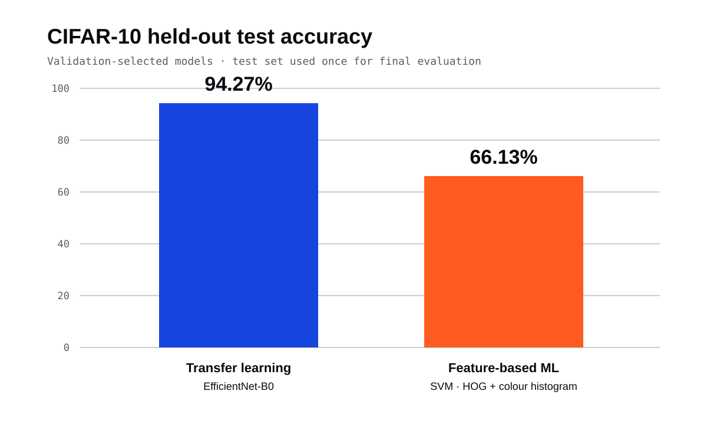

# CIFAR-10: feature-based ML vs transfer learning

University team project comparing traditional feature-based machine learning with transfer-learning convolutional neural networks for ten-class image classification on CIFAR-10.

## Results

| Approach | Selected model | Test accuracy |
| --- | --- | ---: |
| Machine learning | SVM with HOG and colour-histogram features | 66.13% |
| Deep learning | EfficientNet-B0 selected using validation accuracy | 94.27% |

The project also evaluated Random Forest and KNN baselines, plus VGG16 and ResNet-34 transfer-learning models. Model selection used validation performance; the held-out test set was reserved for final evaluation.

## Waralee's contribution

Waralee Sridokmai contributed dataset preprocessing and final review across the shared ML and DL workflows.

This was a team assignment. The notebooks retain the contribution statement that distinguishes each member's responsibilities. This public portfolio copy has a fresh Git history and omits student identifiers, submission archives, assessment documents, checkpoints, and trained-model binaries.

## Workflow

### Traditional machine learning

- Normalise CIFAR-10 images and prepare labels.
- Engineer HOG and RGB colour-histogram features.
- Tune SVM, Random Forest, and KNN models using cross-validation.
- Evaluate the validation-selected model on the untouched test set.

### Deep learning

- Build consistent training, validation, and test preprocessing pipelines.
- Fine-tune VGG16, ResNet-34, and EfficientNet-B0 pretrained on ImageNet.
- Compare validation behaviour, training cost, and test performance.
- Analyse confusion matrices and class-level errors.

## Repository guide

- [`development_ML.ipynb`](development_ML.ipynb) — feature engineering, model tuning, and ML evaluation
- [`development_DL.ipynb`](development_DL.ipynb) — transfer learning, DL evaluation, and final comparison
- [`ml_outputs/`](ml_outputs/) — exported ML evaluation artefacts
- [`dl_vs_ml_comparison.png`](dl_vs_ml_comparison.png) — headline comparison

## Running the notebooks

The notebooks are designed for Google Colab. A GPU runtime is recommended for the deep-learning notebook.

1. Clone this repository.
2. Install the supporting packages with `python -m pip install -r requirements.txt` if running locally.
3. Run each notebook from top to bottom. CIFAR-10 is downloaded during setup.

The exported figures document the original run. Re-training can vary with hardware and library versions even though random seeds and deterministic settings are used where practical.

## Scope

This repository is an educational portfolio copy. Results should be interpreted in the context of the documented dataset split, compute budget, and model-selection process.
